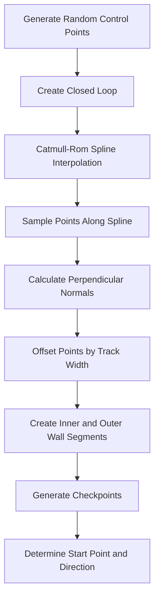
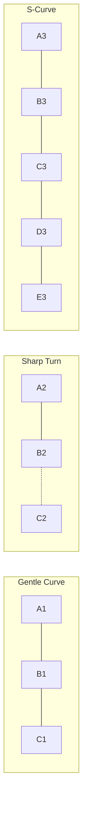

# Track Generation Redesign Plan

## Overview

This document outlines the plan to redesign the track generation system to create more interesting tracks with curves that bend both left and right, while maintaining the randomizer functionality and ensuring no gaps in the walls.

## Current Implementation Analysis

The current track generation in [`Track.ts`](src/Track.ts) uses:
- An elliptical base shape with sinusoidal noise
- Independent generation of inner and outer walls
- 30 segments around the ellipse

**Problems with current approach:**
1. Limited curve variety - mostly follows elliptical shape
2. Inner and outer walls generated independently can create inconsistent track width
3. Curves primarily follow the ellipse direction, lacking S-curves

## Proposed Solution: Center Line Spline Approach

### Core Concept

Instead of generating inner and outer walls independently, we will:

1. **Generate a center line** using Catmull-Rom spline interpolation through control points
2. **Calculate perpendicular normals** at each point along the center line
3. **Offset inward and outward** by half the track width to create walls

This guarantees:
- No gaps in walls (continuous center line)
- Consistent track width throughout
- Smooth, natural curves in any direction

### Algorithm Steps



### Detailed Implementation

#### 1. Control Point Generation

Generate 6-10 control points around the canvas center with randomization:

```typescript
interface ControlPoint {
    angle: number;      // Base angle around center
    radius: number;     // Distance from center
    radiusVariation: number; // Random variation
}
```

- Base angles evenly distributed: `2π / numPoints`
- Random angle variation: `±15%` of segment angle
- Random radius variation: `±30%` of base radius
- Use seeded PRNG for reproducibility

#### 2. Catmull-Rom Spline

Catmull-Rom splines provide smooth interpolation through control points with local control:

```
P(t) = 0.5 * [(-p0 + 3p1 - 3p2 + p3)*t³ 
       + (2p0 - 5p1 + 4p2 - p3)*t² 
       + (-p0 + p2)*t 
       + 2p1]
```

For closed loop, wrap control points: `p[-1] = p[n-1]`, `p[n+1] = p[0]`

#### 3. Track Width and Wall Generation

- **Track width**: Fixed value, e.g., 80-100 pixels
- **Inner wall**: Center point - normal * halfWidth
- **Outer wall**: Center point + normal * halfWidth
- **Normal calculation**: Perpendicular to tangent direction

```typescript
// Tangent from spline derivative
tangent = normalize( nextPoint - prevPoint )
// Perpendicular normal
normal = perpendicular( tangent ) // rotate 90 degrees
```

#### 4. Ensuring No Gaps

Key strategies:
1. **High segment count**: Sample spline at 100+ points for smoothness
2. **Direct line segments**: Connect consecutive sampled points
3. **Closed loop guarantee**: Last point connects to first point

#### 5. Start Point Calculation

- Find the rightmost point on the center line (or a designated segment)
- Place start point on center line
- Direction: tangent at that point (facing along the track)

### Curve Variety Mechanisms

To achieve a mix of gentle and sharp curves:

1. **Variable control point spacing**: Closer points create sharper curves
2. **Radius variation**: Points closer to center create tighter turns
3. **Angle variation**: Creates S-curves when consecutive points deviate in opposite directions



### Code Structure Changes

#### New Methods in Track Class

```typescript
class Track {
    // New properties
    centerLine: Vector[] = [];
    trackWidth: number = 80;
    
    // New methods
    private generateControlPoints( w: number, h: number, random: () => number ): Vector[];
    private catmullRomSpline( points: Vector[], segments: number ): Vector[];
    private calculateNormal( p0: Vector, p1: Vector, p2: Vector ): Vector;
    private generateWallsFromCenterLine(): void;
    
    // Modified method
    generateSimpleLoopedTrack( w: number, h: number, seed: number ): void;
}
```

### Configuration Parameters

| Parameter | Default | Range | Description |
|-----------|---------|-------|-------------|
| `numControlPoints` | 8 | 6-12 | Number of control points |
| `trackWidth` | 80 | 60-120 | Width of track in pixels |
| `splineSegments` | 100 | 80-150 | Points sampled from spline |
| `radiusVariation` | 0.3 | 0.1-0.5 | Random radius variation factor |
| `angleVariation` | 0.15 | 0.05-0.25 | Random angle variation factor |

### Backward Compatibility

- Keep existing `randomize()` method signature
- Keep existing `seed` parameter behavior
- Maintain same wall/checkpoint data structures
- No changes needed to Boid collision detection

## Implementation Checklist

- [ ] Add `centerLine` property and `trackWidth` constant
- [ ] Implement `generateControlPoints()` with seeded randomization
- [ ] Implement `catmullRomSpline()` interpolation
- [ ] Implement `calculateNormal()` for perpendicular vectors
- [ ] Implement `generateWallsFromCenterLine()` 
- [ ] Update `generateSimpleLoopedTrack()` to use new approach
- [ ] Update start point calculation for new track shape
- [ ] Test with various seeds for variety
- [ ] Verify no gaps in walls visually and collision-wise

## Visual Comparison

### Current Track Shape
```
    ┌─────────────────┐
    │                 │
    │   ┌─────────┐   │
    │   │         │   │
    │   │         │   │
    │   └─────────┘   │
    │                 │
    └─────────────────┘
```
*Basic oval with minor variations*

### New Track Shape
```
    ┌─────────────────┐
    │       ┌───┐     │
    │   ┌───┘   └───┐ │
    │   │           │ │
    │ ┌─┘           └─┐│
    │ │               ││
    │ └─┐           ┌─┘│
    │   │           │  │
    │   └───┐   ┌───┘  │
    │       └───┘      │
    └─────────────────┘
```
*Varied curves with S-turns and varying radii*

## Risk Mitigation

1. **Self-intersecting tracks**: Add validation to reject problematic control point configurations
2. **Too narrow passages**: Ensure minimum radius from center based on track width
3. **Start point on sharp curve**: Choose start point on a straighter section

## Next Steps

1. Review and approve this plan
2. Switch to Code mode for implementation
3. Test with existing AI to ensure compatibility
